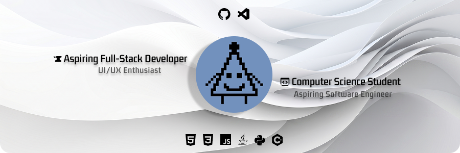

# Hi Mate, I'm Nico ✨

  

## 🚀 About Me

I'm an 18-year-old student currently pursuing a technical degree in Computing. My passion lies in software development and AI prompt learning, though I'm currently diving deep into the world of **React** to become a versatile Full-Stack Developer.

* 🔭 **Current focus**: Strengthening my **Frontend foundations** and exploring every aspect of **Full-Stack Development**.
* 🧠 **Key interests**: UI/UX design, database development, backend logic, and architecting systems through **UML diagrams**.
* ⚡ **Fun fact**: Beyond coding, I’m a dedicated gamer and series marathoner. 🎮🍿

---

## Tech Stack

### 💻 Languages

### 🌐 Frontend & Design

### 🗄️ Backend & Tools

---

## 🛠️ Featured Projects

### ☕ Personal Website
*Planned release: June 5th, 2026*
- A comprehensive hub featuring my full professional journey and detailed project case studies.
- Developed as my first major **React** integration, focusing on high-performance UI/UX.
- Features a clean, professional interface designed for a seamless user experience.

### 💡 InnovaLink
A website planned for *Academic Software Project*
- A digital ecosystem designed to bridge the gap between entrepreneurs and smart capital through dynamic project Showcasing and integrated messaging.
- **Architected from scratch**: Includes full **UML documentation** (Class, Use Case, and Sequence diagrams) before implementation.
- **Backend & Data**: Built with Java (Javalin) and MariaDB, utilizing Stored Procedures to handle critical backend logic, security, and data integrity.

### 📂 More Projects
Looking for my academic work? Check out my [**GitHub Organization**](https://github.com/Ixion-Systems) where I host my technical degree repositories.

---

## 📊 GitHub Stats

  

